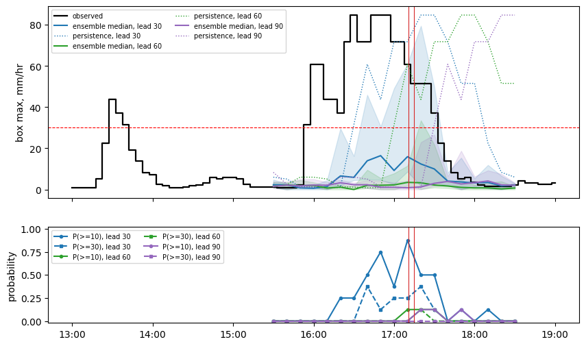
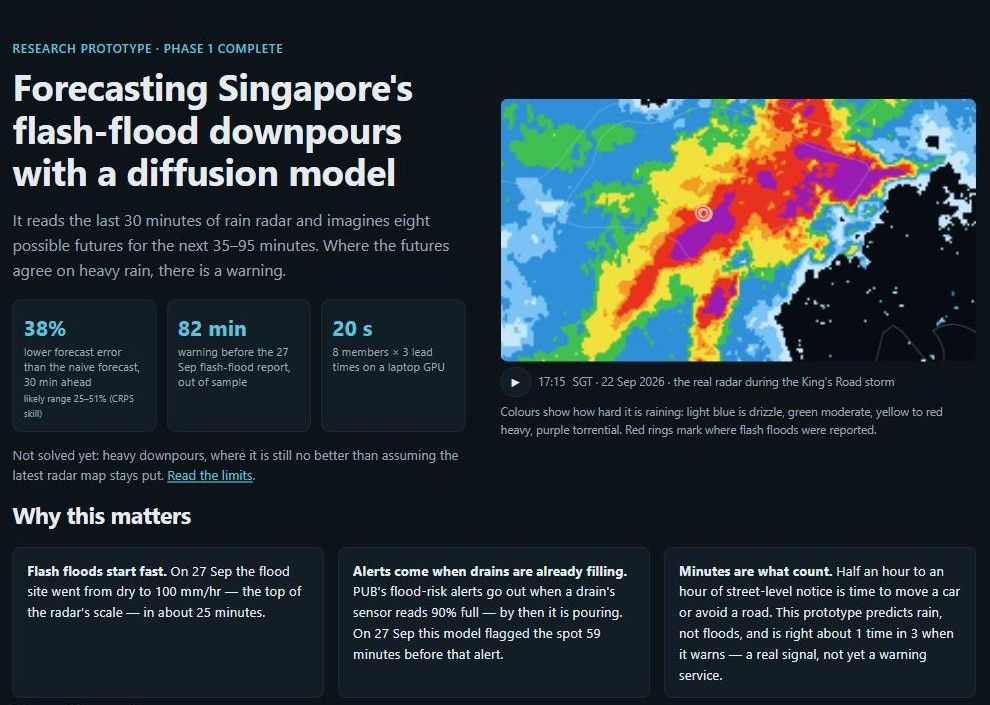
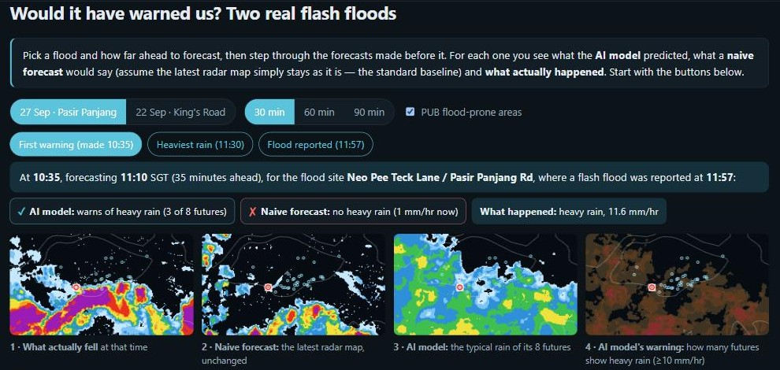
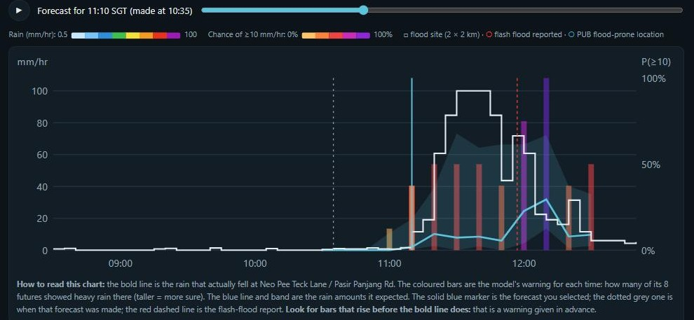
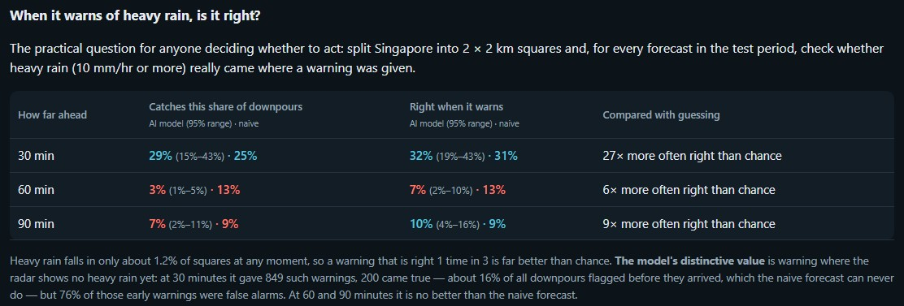
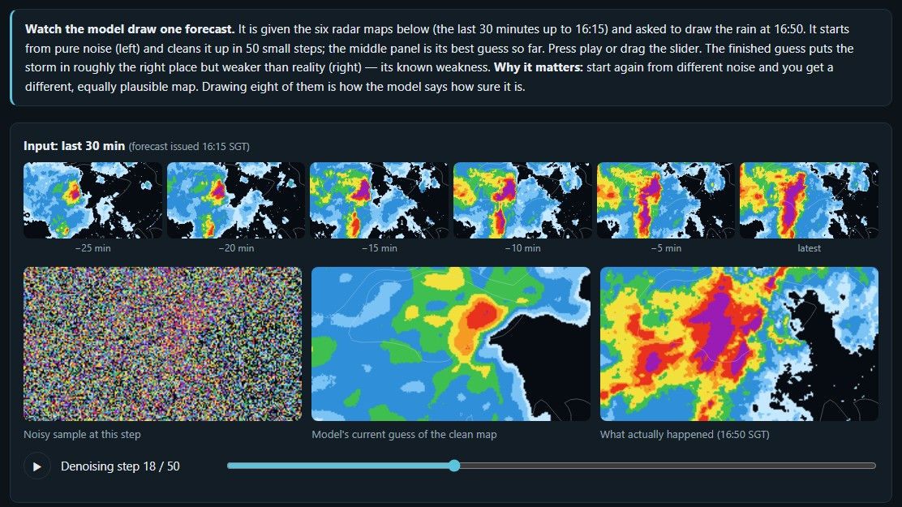
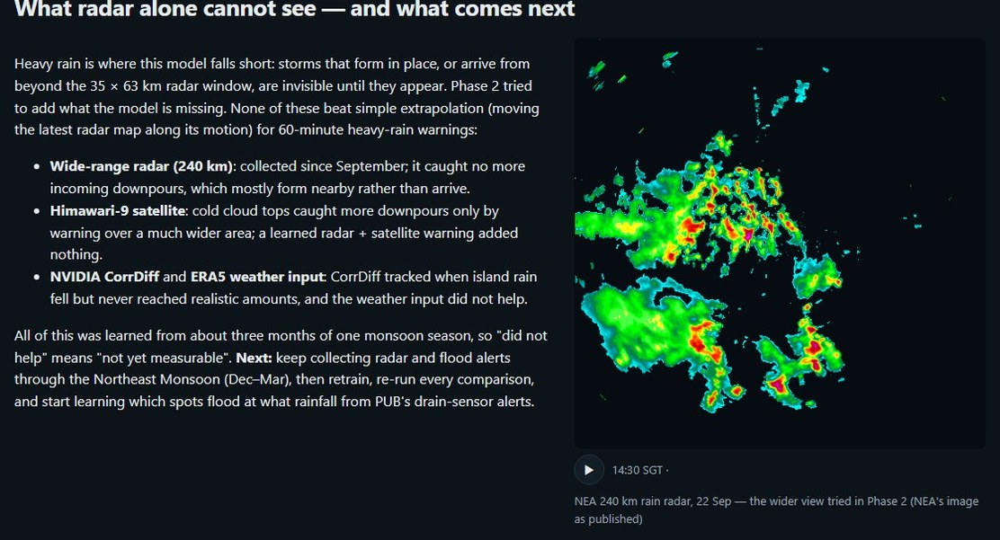
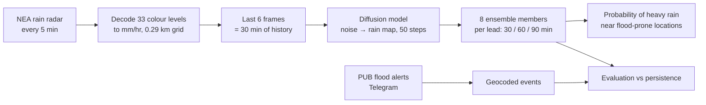

# Singapore flash-flood nowcasting with generative diffusion

**A diffusion model that looks at the last 30 minutes of Singapore's rain radar and generates an
ensemble of possible rain maps for the next 35–95 minutes — built to give neighbourhood-level
warning of the sudden downpours that cause flash floods.**

**Interactive dashboard: [https://beese54.github.io/singapore-diffusion-nowcast/](https://beese54.github.io/singapore-diffusion-nowcast/)** — three flash-flood days, forecast by forecast, and the evidence.

An independent research project, run end-to-end on one laptop GPU (RTX 4060, 8 GB): radar and
flood-report collection since May 2026, a 25.8M-parameter diffusion nowcaster, and an evaluation
that reports what works *and what does not*. Phase 1 is complete. Phase 2 tested six ways of warning of heavy
rain further ahead: NVIDIA CorrDiff downscaling, ERA5 weather input, the 240 km wide-range radar, a motion input,
recalibrated and hybrid warnings, and Himawari-9 satellite. None beat plain extrapolation at 60 minutes (see
[Results §6](docs/RESULTS.md)). With 103 days of training data from one monsoon season, that means "no measurable
gain yet", not "cannot work". **Status (Sep 2026): collection mode** until the Northeast Monsoon has been recorded
(see Roadmap).



*22 Sep 2026, King's Road flash flood (red lines: flood reports). Top: observed rain near the site
(black) and ensemble forecasts; bottom: forecast probability of ≥10 mm/hr. Radar-derived figure —
radar imagery © NEA / Meteorological Service Singapore (weather.gov.sg), shown for personal,
non-commercial, informational use only.*

## The dashboard at a glance

Screenshots from the [live dashboard](https://beese54.github.io/singapore-diffusion-nowcast/). Radar imagery
© NEA / Meteorological Service Singapore (weather.gov.sg), shown for personal, non-commercial, informational use only.

| | |
|---|---|
|  |  |
| **Overview.** What the model does, the headline numbers, and why minutes matter. | **Would it have warned us?** The 10:35 forecast for the 27 Sep flood: the model warns (3 of 8 futures), the naive forecast doesn't, heavy rain came. |
|  |  |
| **Warnings before the rain.** Bars (model warnings) rise before the bold line (observed rain); red dashes mark the flood report. | **The honest scorecard.** 30 min ahead: catches 29% of downpours, right 1 time in 3 (27× chance); 60/90 min: no better than the naive forecast (at 60 min, plain extrapolation is the better heavy-rain warning). |
|  |  |
| **How it draws a forecast.** From random noise to a rain map in 50 steps, guided by the last 30 minutes of radar. | **What Phase 2 found.** Wider radar, satellite, CorrDiff and ERA5 did not beat simple extrapolation yet; next is more data through the Northeast Monsoon. |

## Results in one table

Held-out test period (14–25 Sep 2026), 200 forecast times × 8 members, against persistence
(repeat the last radar frame). Details and all other scores: [docs/RESULTS.md](docs/RESULTS.md).

| Lead (time after last radar frame) | CRPS skill [95% CI] | Rain placement, FSS ≥2 mm/hr (model / persistence) | Heavy rain, FSS ≥10 mm/hr (model / persistence) |
|---|---|---|---|
| 30 min (35) | **+0.38** [+0.25, +0.51] | **0.83** / 0.74 | 0.34 / **0.45** |
| 60 min (65) | +0.42 [+0.27, +0.58] | 0.56 / 0.56 | 0.06 / **0.24** |
| 90 min (95) | +0.41 [+0.28, +0.56] | 0.57 / 0.51 | 0.09 / **0.16** |

- **Works:** at 30 minutes the ensemble is a better probabilistic forecast than persistence.
  Out of sample, it flagged the **27 Sep 2026 Pasir Panjang flash flood 82 minutes before the flood
  report**, while the radar still showed the site dry, and the 22 Sep King's Road flood 86 minutes
  ahead.
- **Does not work yet:** **heavy rain** (≥10 mm/hr, what actually floods roads) is not predicted
  better than persistence at any lead, and intensities are 5–10× too weak. Longer leads only help
  with light rain. **This is a research prototype, not a warning system.** See
  [docs/LIMITATIONS.md](docs/LIMITATIONS.md).
- **Fast:** 20 seconds for 8 members × 3 lead times on a laptop GPU.

## How it works



The model is a conditioned U-Net trained as a v-prediction DDPM (one model per lead; the 60/90-min
models are warm-started from the 30-min one). Each forecast starts from random noise and is
denoised in 50 steps, conditioned on the recent radar; repeating that 8 times gives 8 different,
plausible futures, whose agreement is the forecast probability.
Full method: [docs/METHODS.md](docs/METHODS.md).

## Repository map

| Path | What |
|---|---|
| `src/data/radar_dataset.py` | dataset, pinned train/val/test split, the model-input transform |
| `src/model/` | U-Net and diffusion (v-prediction, DDIM sampling) |
| `train.py` | training, resumable, `--init-from` warm start |
| `src/inference/nowcast.py` | live forecast from the latest radar frames |
| `scripts/` | data collection, preprocessing, geocoding, evaluation, case studies |
| `notebooks/02_nowcast_evaluation.ipynb` | flash-flood case studies: 22 Sep (§1–6), 27 and 30 Sep (§7) |
| `notebooks/03_flood_risk_overlay.ipynb` | forecast probability over PUB flood-prone areas |
| `results/` | evaluation results of record; `results/ablations/` for superseded runs |
| `docs/` | methods, results, limitations, data, reproduction, lessons; `docs/history/` for past plans |
| `tasks/` | working plan (`plan_phase2.md`), checklist (`todo.md`), full lessons log |
| `definition_of_done.md`, `progress_tracking.json` | stage-by-stage acceptance criteria and status |

## Quick start

```bash
bash init.sh && cp .env.example .env
python scripts/scrape_radar.py --hours 168        # NEA keeps ~7 days: your archive starts today
python scripts/preprocess_radar.py
python train.py --max-steps 300000 --resume auto  # ~11 h on an RTX 4060
python scripts/evaluate.py --checkpoint checkpoints/nowcaster/ckpt_step_300000.pt
```

Step-by-step instructions, including the scheduled collection tasks: [docs/REPRODUCE.md](docs/REPRODUCE.md).

## What we learned

The most useful part for other researchers may be what failed: ε-prediction, rain-weighted losses,
residual targets, crops, and a flood-event evaluation that turned out to be partly in-sample. Each
is written up with the evidence in [docs/LESSONS.md](docs/LESSONS.md).

## Roadmap (Phase 2)

- **Done, did not help (as tried):**
  - NVIDIA CorrDiff (PhysicsNeMo) ERA5 → 2 km downscaling;
  - ERA5 weather input to the 30-min model;
  - the 240 km wide-range radar, extrapolated (collected, gap-watched and georeferenced from Sep 2026).
- **Motion forecast as an extra input (done):** the 60-min model placed light rain better but still smoothed
  away heavy rain. For 60-min heavy-rain warnings, plain optical-flow extrapolation is better than any
  diffusion model tried (catches 17% vs 7%).
- **Warning calibration and a hybrid warning (done):** re-choosing the 60-min model's warning rule on validation
  lifts its heavy-rain catch from 3% to 35% (CSI 0.02 → 0.11; fragile across random seeds), but it still does not
  beat extrapolation. A hybrid of the two catches 38% but is right only 13% of the time, so it did not beat
  extrapolation either. **Plain extrapolation is the recommended 60-min heavy-rain warning**; the diffusion model
  stays the probability and rain-amount forecast ([Results §2b](docs/RESULTS.md)).
- **Satellite (Himawari-9) (done, did not help as tried):** a cold-cloud rule caught more incoming heavy rain only by
  warning over a wider area (precision halved). A learned radar + satellite warning, compared at the same number of
  warnings, added nothing over radar alone and did not beat extrapolation.
- **Drain-alert benchmark:** done ([Results §3b](docs/RESULTS.md)).
- **Next (collection mode, Oct 2026 – Mar 2027):** radar (70 and 240 km) and PUB flood alerts keep collecting
  through the Northeast Monsoon (Dec–Mar), with new flash floods added as case studies. Satellite needs no collection:
  Himawari-9 is a public archive and can be downloaded when needed. Around Apr 2027:
  retrain on both seasons, re-run the scripted comparisons above (including satellite), and start the per-location
  flood model once enough drain alerts have accumulated.

Plan: [tasks/plan_phase2.md](tasks/plan_phase2.md).

## Data and licences

- **Code:** MIT ([LICENSE](LICENSE)). **Documentation and figures:** CC BY 4.0.
- **Radar imagery © National Environment Agency (NEA) / Meteorological Service Singapore
  ([weather.gov.sg](https://www.weather.gov.sg)).** Radar-derived figures are shown for personal,
  non-commercial and informational purposes only, per the
  [weather.gov.sg Terms of Use](https://www.weather.gov.sg/terms-of-use/). The radar archive itself is
  not redistributed.
- Flood alerts: PUB (@pubfloodalerts). Geocoding: OneMap (SLA). ERA5: Copernicus / ECMWF.
- This is an independent project, not affiliated with or endorsed by NEA, MSS, PUB or NVIDIA.
  Details: [docs/DATA.md](docs/DATA.md).

## Citation

See [CITATION.cff](CITATION.cff).
